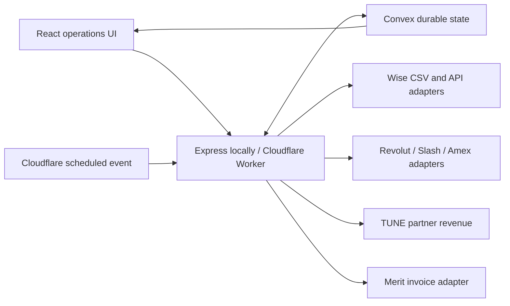

# Finance Operations Dashboard

Finance Operations Dashboard is a full-stack cash-flow and reconciliation workspace for a media-buying business. It replaces a spreadsheet-driven process with durable transaction imports, counterparty/category learning, team-attributed revenue, invoice review, profit distribution, and currency-aware operating views.

**Showcase:** [finance.thatcanadian.dev](https://finance.thatcanadian.dev)

> **Status:** Development/showcase deployment. The current Cloudflare Worker points at development Convex state and is not a substitute for production access controls. Do not load sensitive production finance data until authentication and the production deployment are explicitly configured.

## Problem and Approach

The original workflow required manually combining bank activity, partner revenue, providers, clients, categories, invoices, and partner distributions in a shared spreadsheet. The dashboard models those records directly and preserves the operator's decisions so recurring transactions become easier to reconcile over time.

The system follows three rules:

1. Never invent balances when an integration is unavailable.
2. Never add unlike currencies into a misleading total.
3. Keep external accounting state separate from local review decisions.

## Core Workflows

- Import Wise statement CSVs and deduplicate overlapping uploads by transaction ID.
- Separate incoming and outgoing reconciliation queues.
- Suggest companies and categories from saved aliases, while requiring an explicit review before learning a new mapping.
- Assign transactions and cardholders to teams for filtered operating views.
- Create local sales-invoice drafts for incoming funds and supplier-bill drafts for outgoing funds.
- Keep local paid/review state independent from Merit accounting status.
- Store clients, suppliers, platforms, tags, invoice-ready details, and provider aliases.
- Pull partner-level or team-attributed revenue through TUNE/HasOffers-compatible integrations with timezone-aware reporting periods.
- Create a Merit invoice only through a separate, explicitly confirmed dashboard action.
- Track profit-share, salary, payable, paid, waived, deferred, and manually adjusted distribution amounts.
- Display Wise, Revolut, Slash, Amex-ready, revenue, receivable, payable, company, and distribution workflows without fabricating unavailable data.

## Architecture



### Runtime Modes

- **Local:** Vite frontend plus an Express server; local state is written under `.local/` when Convex is not configured.
- **Cloudflare:** Static assets and API routes run from one Worker.
- **Convex:** Stores the durable dashboard snapshot and rejects unauthenticated or stale whole-state writes.

## Reliability and Data Integrity

### Currency Isolation

Derived cash, revenue, payable, distribution, and profit metrics stay grouped by currency. If records contain multiple currencies, the dashboard does not invent a single converted total.

### Learned Matching Without Silent Mutation

Counterparty and category aliases are created from reviewed matches. Deleting a company clears references without deleting the underlying financial history.

### Stale-Write Protection

Convex state includes revision-aware write protection so an older browser snapshot cannot silently overwrite newer decisions.

### Explicit Merit Writes

Revenue pulls and scheduled syncs never create Merit invoices. The separate “Send to Merit” action warns that it creates a real external accounting record, requires an account-specific Merit tax selection plus explicit confirmation, and reserves the operation atomically before calling Merit. `MERIT_WRITES_ENABLED` is the hard deployment gate; production enables it only for this manual action.

### Secret Boundaries

Bank, partner, accounting, and OpenRouter credentials stay in the server/Worker environment. Merit API ID/key and `OPENROUTER_API_KEY` are never stored in Convex or returned to the browser. Calls into Convex require a matching `CONVEX_SERVICE_TOKEN`.

### Regression Coverage

The current test suite covers currency math, empty-state behavior, service-token enforcement, stale writes, atomic invoice reservations, company deletion, secret scrubbing, and API fail-closed behavior.

## Technology

| Layer | Technologies |
| --- | --- |
| Frontend | React, TypeScript, Vite, Tailwind CSS, shadcn/ui |
| Local API | Express 5, TypeScript |
| Cloud API | Cloudflare Workers |
| State | Convex |
| Integrations | Wise, Revolut, Slash, Amex, TUNE/HasOffers, Merit |
| Quality | Node test runner, TypeScript project references |

## Repository Layout

```text
src/                    React dashboard and UI components
server/                 Local API, calculations, matching, persistence, integrations
worker/                 Cloudflare Worker API and scheduled handler
shared/                 Currency, revenue, distribution, category, and provider logic
convex/                 Durable dashboard state and schema
.env.example            Supported runtime configuration
wrangler.jsonc          Worker routes, vars, and scheduled triggers
```

## Local Development

```bash
npm install
cp .env.example .env
npm run dev
```

The frontend runs on `http://localhost:5173` and proxies `/api` requests to the Express server on `http://localhost:8787`.

## Configuration

Use [`.env.example`](.env.example) as the configuration reference. Integration groups include:

- Convex URL/deployment and `CONVEX_SERVICE_TOKEN`;
- Wise API/profile/balance identifiers;
- Revolut Business credentials;
- Slash API credentials;
- Amex OAuth, account IDs, and approved API paths;
- Merit invoice settings;
- TUNE network and revenue-stream credentials;
- server-only OpenRouter configuration.

Missing credentials should produce unavailable/empty integration states rather than seeded financial numbers.

## Wise Statement Imports

The current Netherlands Wise Business profile does not expose the required live statement feed, so CSV import is the supported reconciliation path:

- export one statement per currency balance;
- upload monthly, weekly, or daily depending on the desired cadence;
- overlapping date ranges are safe because transaction IDs are deduplicated;
- review unmatched companies/categories and save aliases for future imports.

## Integration Status

| Integration | Current role |
| --- | --- |
| Wise | CSV statement import; live balance adapter available when supported |
| Revolut | Business API adapter prepared; requires account credentials |
| Slash | Account/transaction adapter prepared; requires API access |
| Amex | OAuth and account/transaction adapter prepared; requires approved API access |
| TUNE-compatible networks | Partner-level and team-attributed revenue pulls |
| Merit | Read-only invoice and tax sync; explicit invoice creation is guarded by a tax selection, confirmation, and a deployment switch |

Prepared adapters are not presented as active integrations until the required provider access and credentials exist.

## Verification

```bash
npm run check
```

The gate runs TypeScript validation, regression tests, and the production frontend build.

## Deployment

```bash
npm run deploy
```

This command builds the app, deploys Convex functions using `.env.local`, and publishes the Cloudflare Worker. The current showcase route is `finance.thatcanadian.dev`.

Before moving from showcase to production:

1. add real user authentication/authorization at the application boundary;
2. point the Worker at the production Convex deployment;
3. configure secrets in Cloudflare and Convex rather than local files;
4. validate each live banking/accounting integration with non-destructive tests;
5. establish audit, backup, and incident procedures for financial data.

## External Documentation

- [Wise Platform](https://docs.wise.com/)
- [Revolut Business API](https://developer.revolut.com/docs/business/business-api)
- [Slash API](https://docs.slash.com/)
- [American Express APIs](https://developer.americanexpress.com/)
- [Merit API](https://api.merit.ee/connecting-robots/reference-manual/authentication/)
- [TUNE Affiliate API](https://developers.tune.com/affiliate)
