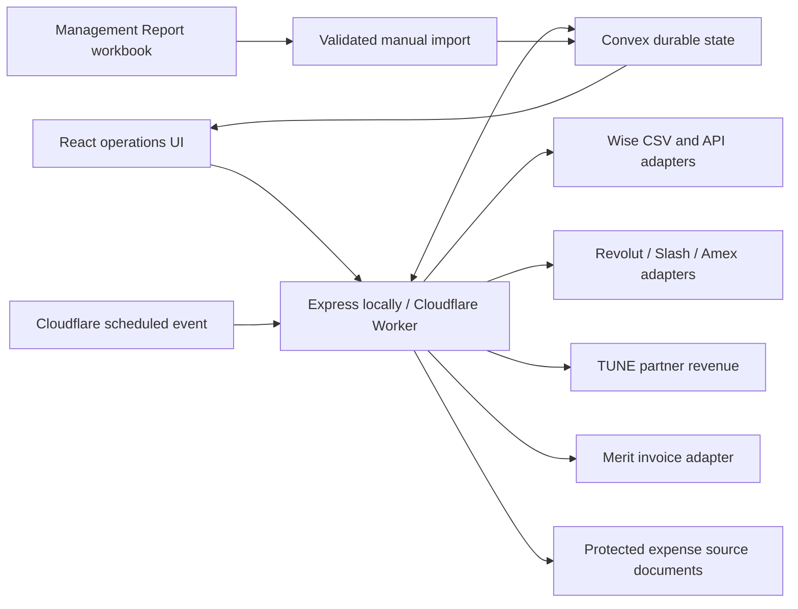

# Finance Operations Dashboard

Finance Operations Dashboard is a full-stack cash-flow and reconciliation workspace for a media-buying business. It replaces a spreadsheet-driven process with durable transaction imports, counterparty/category learning, team-attributed revenue, invoice drafting and collection, profit distribution, holdings, and currency-aware operating views.

**Showcase:** [finance.thatcanadian.dev](https://finance.thatcanadian.dev)

> **Status:** Development deployment. The Cloudflare deployment is protected by whole-site authentication and currently points at development Convex state. Do not treat the development data store as the final production environment.

## Problem and Approach

The original workflow required manually combining bank activity, partner revenue, providers, clients, categories, invoices, and partner distributions in a shared spreadsheet. The dashboard models those records directly and preserves the operator's decisions so recurring transactions become easier to reconcile over time.

The system follows three rules:

1. Never invent balances when an integration is unavailable.
2. Keep exact native-currency totals visible and label converted USD totals as approximate.
3. Keep external accounting state separate from local review decisions.

## Core Workflows

- Import Wise statement CSVs and deduplicate overlapping uploads by transaction ID.
- Separate incoming and outgoing reconciliation queues.
- Suggest companies and categories from saved aliases, while requiring an explicit review before learning a new mapping.
- Assign transactions and cardholders to teams for filtered operating views.
- Pull recurring client revenue through configured APIs, keep invoice preparation on the Revenue page, and reserve transaction-row invoice drafting for exceptional incoming payments.
- Record outgoing bank payments as paid expenses, or enter unpaid supplier bills first and match the later bank payment by exact amount and currency.
- Preserve supplier-issued receipts and invoices as protected source documents; when an original cannot be obtained, generate a clearly labelled internal missing-document declaration PDF linked to the bank payment.
- Capture Estonia/EU-oriented supplier identity, registry and VAT numbers, economic content, business purpose, supply and due dates, native currency, and VAT treatment, including 24%, 13%, 9%, zero-rated, exempt, and reverse-charge cases.
- Keep local paid/review state independent from Merit accounting status.
- Store clients, suppliers, platforms, tags, invoice-ready details, and provider aliases.
- Preview partner-level or team-attributed revenue through TUNE/HasOffers-compatible integrations without persisting manual searches.
- Run income automation every Monday at 09:00 in `Asia/Beirut`, with DST-aware scheduling, idempotent local drafts, and hourly catch-up retries after the weekly release time.
- Track weekly and monthly current-period revenue as accruing future invoices without double-counting after drafts are created.
- Create a Merit invoice only through a separately confirmed action, with distinct “Save in Merit” and “Save & deliver” choices.
- Match exact incoming bank payments to open invoices and predict collection dates from the latest five confirmed matches.
- Record partial or combined payments with source and notes while keeping dashboard paid state independent from Merit.
- Record cash, exchange, and wallet holdings, including fiat and crypto assets.
- Show a clearly labeled approximate USD total from keyless Coinbase rates while retaining exact native balances.
- Track profit-share, salary, payable, paid, waived, deferred, and manually adjusted distribution amounts.
- Import the legacy Management Report workbook into a dedicated Management workspace with summary, business-unit, platform, offer, ledger, and ownership views.
- Display Wise, Revolut, Slash, Amex-ready, revenue, receivable, payable, company, and distribution workflows without fabricating unavailable data.

## Architecture


```mermaid
flowchart LR
    U["React operations UI"] --> API["Express locally / Cloudflare Worker"]
    API <--> C["Convex durable state"]
    API --> W["Wise CSV and API adapters"]
    API --> R["Revolut / Slash / Amex adapters"]
    API --> T["TUNE partner revenue"]
    API --> M["Merit invoice adapter"]
    API --> D["Protected expense source documents"]
    CRON["Cloudflare scheduled event"] --> API
    SHEET["Management Report workbook"] --> IMPORT["Validated manual import"]
    IMPORT --> C
    C --> U
```

### Runtime Modes

- **Local:** Vite frontend plus an Express server; local state is written under `.local/` when Convex is not configured.
- **Cloudflare:** Static assets and API routes run from one Worker.
- **Convex:** Stores the durable dashboard snapshot and rejects unauthenticated or stale whole-state writes.

## Reliability and Data Integrity

### Exact and Approximate Currency Views

Derived cash, revenue, payable, distribution, and profit metrics stay grouped by native currency. Headline cards and panel totals convert those buckets into one USD amount using timestamped, keyless Coinbase rates; the exact native-currency split remains visible underneath or in the underlying rows. Rates refresh hourly and with Sync, retain last-known values during a feed interruption, and disclose stale or unsupported currencies instead of presenting an incomplete amount as a total.

### Learned Matching Without Silent Mutation

Counterparty and category aliases are created from reviewed matches. Revenue rules are persisted child records under client companies: deleting a client removes its future pull rules and clears company references without deleting the underlying invoice, revenue-run, or transaction history.

### Stale-Write Protection

Convex state includes revision-aware write protection so an older browser snapshot cannot silently overwrite newer decisions.

### Expense Source Documents

The Expenses workspace separates accounting records from bank movements. Supplier bills can be recorded before payment and become payables; a later outgoing transaction can be matched only when its currency and gross amount agree. Paid card or bank expenses can be recorded directly from the transaction row.

The preferred evidence is always the supplier-issued receipt or invoice, stored privately and linked to the expense record. If the supplier document is unavailable, an operator can generate an internal source-document declaration from the outgoing bank transaction and entered business details. That PDF is visibly marked as not being a supplier receipt or VAT invoice, and the workflow records no deductible input VAT for it.

### Explicit Merit Writes and Delivery

Manual revenue pulls are temporary previews. Preparing a draft re-fetches the selected period server-side and persists the revenue run and editable local invoice together; scheduled jobs continue to maintain accruals and configured automatic drafts. Neither path calls Merit. A confirmed operator action can either save an invoice in Merit or save and deliver it by email. The invoice becomes open immediately after Merit creation, before delivery is attempted, so retrying delivery cannot duplicate the accounting document. `MERIT_WRITES_ENABLED` is the hard deployment gate for both actions.

### Authoritative Merit Reads

Successful read-only Merit syncs import customers and vendors into Companies with their identity, contact, tax, address, currency, payment-term, bank, group, comment, and dimension data. Merit-linked invoices, customers, and vendors that no longer exist in a complete successful Merit response are removed locally. A failed or incomplete endpoint response never triggers deletion, and the sync does not write anything to Merit.

### Local Payment State

Invoices follow the dashboard lifecycle `draft → open → paid`. Merit payment status is read-only metadata and never controls or receives a local paid action. Payment allocations record source, date, amount, reference, and notes; allocations can cover part of an invoice or combine several payments.

### Secret Boundaries

Bank, partner, accounting, and OpenRouter credentials stay in the server/Worker environment. Merit API ID/key and `OPENROUTER_API_KEY` are never stored in Convex or returned to the browser. Calls into Convex require a matching `CONVEX_SERVICE_TOKEN`.

### Whole-Site Authentication

The Cloudflare Worker authenticates every page, API request, and application asset before serving it. Only the non-sensitive favicon, home-screen icons, and web app manifest are public so browsers can identify the app on the login screen. A successful login creates a signed, `HttpOnly`, `Secure`, `SameSite=Strict` cookie that expires after 12 hours. The password is stored only as a salted PBKDF2-SHA-256 verifier, while the username, verifier, and independent session-signing key are encrypted Cloudflare Worker secrets.

Configure or rotate the production credentials from an interactive terminal:

```bash
npm run auth:configure
```

The password prompt is hidden. The setup command sends the derived verifier and generated signing key directly to Cloudflare without printing them or writing them to disk. Missing or malformed authentication secrets lock the site and API closed.

### Regression Coverage

The current test suite covers currency math, empty-state behavior, service-token enforcement, stale writes, atomic invoice reservations, company deletion, secret scrubbing, and API fail-closed behavior.

## Technology

| Layer | Technologies |
| --- | --- |
| Frontend | React, TypeScript, Vite, Tailwind CSS, shadcn/ui |
| Local API | Express 5, TypeScript |
| Cloud API | Cloudflare Workers |
| State | Convex |
| Integrations | Wise, Revolut, Slash, Amex, TUNE/HasOffers, Merit |
| Quality | Node test runner, TypeScript project references |

## Repository Layout

```text
src/                    React dashboard and UI components
server/                 Local API, calculations, matching, persistence, integrations
worker/                 Cloudflare Worker API and scheduled handler
shared/                 Currency, revenue, distribution, category, and provider logic
convex/                 Durable dashboard state and schema
.env.example            Supported runtime configuration
wrangler.jsonc          Worker routes, vars, and scheduled triggers
```

## Local Development

```bash
npm install
cp .env.example .env
npm run dev
```

The frontend runs on `http://localhost:5173` and proxies `/api` requests to the Express server on `http://localhost:8787`.

## Configuration

Use [`.env.example`](.env.example) as the configuration reference. Integration groups include:

- Convex URL/deployment and `CONVEX_SERVICE_TOKEN`;
- Wise API token and selected business profile IDs (their visible balances are discovered automatically);
- Revolut Business client ID, refresh token, and certificate private key (see [`docs/revolut-setup.md`](docs/revolut-setup.md));
- Slash API credentials;
- Amex OAuth, account IDs, and approved API paths;
- Merit invoice creation and email-delivery settings;
- TUNE network and revenue-stream credentials;
- Coinbase exchange-rate endpoint for approximate USD conversion;
- server-only OpenRouter configuration.

Missing credentials should produce unavailable/empty integration states rather than seeded financial numbers.

## Management Report Imports

The Management workspace keeps the legacy workbook in this dashboard while preserving a clear boundary between a closed manual report snapshot and live operating data. The importer reads every workbook tab for source lineage, normalizes the eight visible management tabs, records data-quality checks, and exposes only sanitized reporting data through the public API. Hidden supporting rows and sensitive transaction references are never returned by `/api/management-report`.

Prepare a local snapshot:

```bash
npm run import:management-report -- "https://docs.google.com/spreadsheets/d/SPREADSHEET_ID/edit"
```

Upload the same content-addressed snapshot to Convex after configuring `CONVEX_URL` and the server-only `MANAGEMENT_REPORT_IMPORT_TOKEN`:

```bash
npm run import:management-report -- "https://docs.google.com/spreadsheets/d/SPREADSHEET_ID/edit" --convex
```

A local `.xlsx` path is also accepted. Imports are idempotent by workbook content hash. The May 2026 close stays separate from June source rows, which remain visibly marked as post-close data. Future bank, advertising, revenue, invoice, and FX APIs should write normalized ledger and metric records behind the same reporting model instead of recreating spreadsheet formulas.

## Wise Statement Imports

Wise balances are discovered automatically across the configured business profiles. When a profile does not expose its live statement feed, CSV import remains the supported reconciliation path:

- export one statement per currency balance;
- upload monthly, weekly, or daily depending on the desired cadence;
- overlapping date ranges are safe because transaction IDs are deduplicated;
- review unmatched companies/categories and save aliases for future imports.

## Slash Transaction Loading

The Slash view loads the most recent 45 calendar days by default. Use the From and To controls to load an exact inclusive UTC date range, or use **Show 45 earlier days** below the table to extend the current window. Every selected range follows Slash cursor pagination through all available transactions; it is not capped at a fixed row count.

## Integration Status

| Integration | Current role |
| --- | --- |
| Wise | Selected multi-business balance discovery; live statements when permitted, with CSV statement import for restricted profiles |
| Revolut | Read-only Business API adapter with runtime RS256 client assertions; requires certificate authorization |
| Slash | Account/transaction adapter prepared; requires API access |
| Amex | OAuth and account/transaction adapter prepared; requires approved API access |
| TUNE-compatible networks | Partner-level and team-attributed revenue pulls |
| Merit | Authoritative read-only invoice, customer, vendor, and tax sync; explicit save or save-and-email actions guarded by stored tax rules, confirmation, and a deployment switch |
| Coinbase rates | Keyless approximate fiat and crypto USD rates; native balances remain authoritative |

Prepared adapters are not presented as active integrations until the required provider access and credentials exist.

## Verification

```bash
npm run check
```

The gate runs TypeScript validation, regression tests, and the production frontend build.

## Deployment

```bash
npm run deploy
```

This command builds the app, deploys Convex functions using `.env.local`, and publishes the Cloudflare Worker. The current showcase route is `finance.thatcanadian.dev`.

Before moving from showcase to production:

1. point the Worker at the production Convex deployment;
2. configure integration secrets in Cloudflare and Convex rather than local files;
3. validate each live banking/accounting integration with non-destructive tests;
4. establish audit, backup, and incident procedures for financial data.

## External Documentation

- [Wise Platform](https://docs.wise.com/)
- [Revolut Business API](https://developer.revolut.com/docs/business/business-api)
- [Slash API](https://docs.slash.com/)
- [American Express APIs](https://developer.americanexpress.com/)
- [Merit API](https://api.merit.ee/connecting-robots/reference-manual/authentication/)
- [TUNE Affiliate API](https://developers.tune.com/affiliate)
