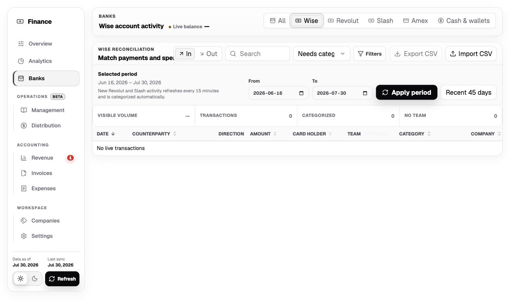
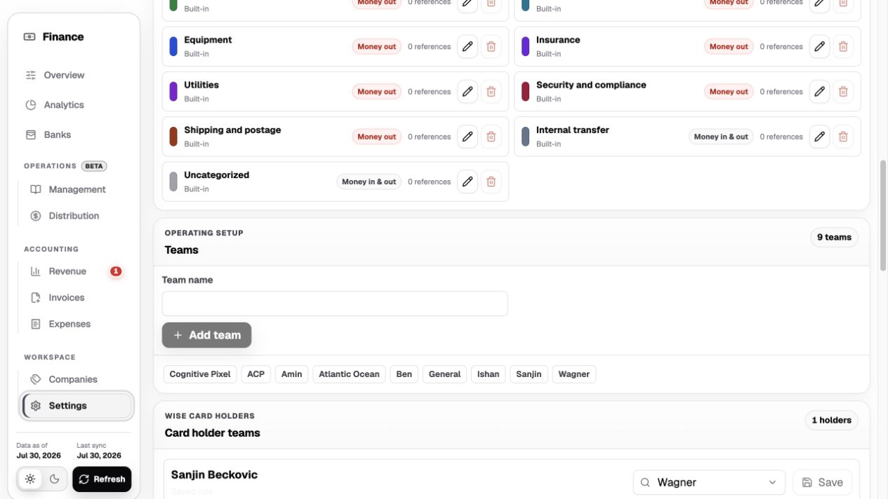
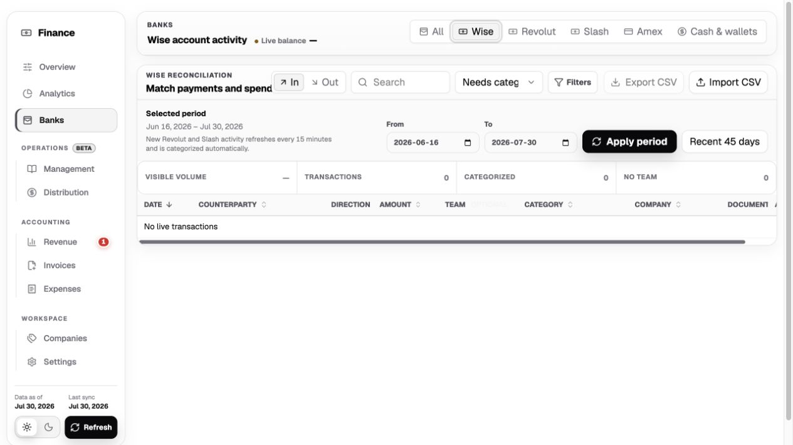
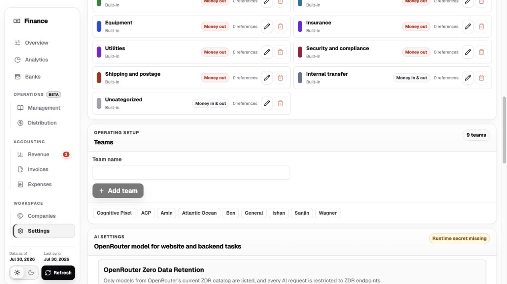

# Transaction responsibility audit

## Scope

Audit the Banks transaction attribution flow and Settings directory to decide whether `Team` correctly represents the person or group responsible for income or spend, and to remove the Wise card-holder assignment concept.

The local audit used the existing dashboard design system at a desktop viewport. The local API did not contain live bank rows, so row-level dropdown behavior and populated-state truncation could not be visually verified.

## Flow

1. **Wise transaction table before — needs correction**

   

   `Card holder` and `Team` appear as adjacent concepts even though the card holder is bank metadata and the selected team is intended to represent business responsibility. The two columns imply that card ownership should determine accountability.

2. **Operating settings before — structurally unclear**

   

   The `Teams` directory mixes actual teams (`Cognitive Pixel`, `Atlantic Ocean`, `Wagner`), people (`Amin`, `Ben`, `Ishan`, `Sanjin`), and an offer (`ACP`). The separate `Card holder teams` rule then assigns a person-shaped bank value to one of those mixed entries.

3. **Wise transaction table after — healthy for the approved cleanup**

   

   The card-holder column is removed, the remaining table is narrower, and responsibility remains an optional explicit assignment. Card-holder values no longer drive team assignment.

4. **Operating settings after — healthy for the approved cleanup**

   

   The Wise card-holder mapping panel is removed. The mixed `Teams` directory remains visible because changing its meaning requires an explicit data-model migration rather than a cosmetic rename.

## Recommendation

`Team` is not the right long-term name for the transaction field. Use **Owner** in the table and model the selected value as a **responsibility assignee** with a required kind:

- `person`: Ben, Amin, Ishan, Sanjin
- `team`: Cognitive Pixel, Atlantic Ocean, Wagner

Keep **Offer** separate from both category and owner:

- `company`: who paid or was paid
- `category`: the accounting/economic reason for the money
- `offer`: the product, vertical, or campaign that produced the money
- `owner`: the person or team responsible

`ACP` should therefore become an offer, not a team and not a category. If owned-offer revenue needs different accounting treatment, add one reusable income category such as `Owned offer revenue`; do not create an income category for every offer name.

## Accessibility limits

The screenshots confirm visible labels, hierarchy, and responsive table width only. Keyboard operation, focus order, screen-reader announcements, populated dropdown option grouping, and error recovery still require an authenticated dataset or dedicated fixture.
